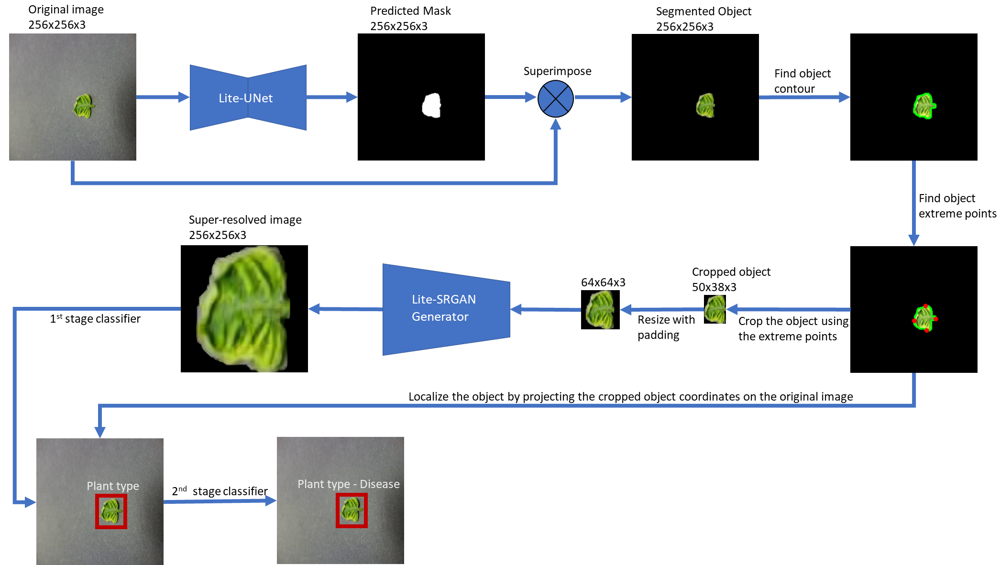

# Lite-SRGAN and Lite-UNet: Towards fast and accurate image super-resolution, segmentation and localization for plant leaf diseases


# Lite-SRGAN
<p float="left">
  
  
  </p>


## Lite-SRGAN architecture


## Qualitative Results
PSNR and SSIM (evaluated on the Y channel of the YCbCr color space) and the perceptual index (PI) used in the PIRM-SR challenge are provided.
<p align="center">
  
</p>

## Abliation Study (Effect of Loss Functions)
Visual comparison of combining different loss functions together, The red sign indicates the added loss function in each experiment.

<p align="center">
  
</p>

## 🕺 Training on your own dataset

```
python main.py --images_dir "/path/to/images/directory" \
--img_width 256 --img_height 256 --upsampling_blocks 2 \
--batch_size 8 --lr 1e-4 --pretraining_epochs 100 --epochs 100
```

* ``` --upsampling_blocks ``` refers to the number of upsampling blocks for upsampling the low resolution image
  i.e (1 upsampling block = 2x upscaling , 2 upsampling blocks = 4x upscaling , 3 upsampling blocks = 8x upscaling, etc.')
  
* ``` --pretraining_epochs ``` refers to the number of epochs where the generator is pre-trained with pixel loss (L1) only to avoid getting stuck in local minima in the early beginning of the training process , Note: number of pre_training steps/iterations = (pretraining_epochs x number of training samples) / batch_size

* ``` epochs ``` if you want to use the same number of training update steps/iterations as stated in the paper, you can get the number of iterations using this equation, number of training steps/iterations = (epochs x number of training samples) / batch_size
 

# Lite-UNet
## Lite-UNet architecture

<p align="center">
  
</p>

## Qualitative Results

<p align="center">
  
</p>

## 🏃 Training on your own dataset

```
python main.py --train_data "/path/to/training/images" \
--train_annot "/path/to/training/annotations" \
--val_data "/path/to/validation/images" \
--val_annot "/path/to/validation/annotations" \
--img_width 224 --img_height 256 --batch_size 32 --lr 0.0001\
--epochs 20 --output_dir "/path/to/save/Lite-UNet/model"
```

# Full Methodology

The full methodology depicts how the two proposed architectures can be used together to form a whole superior lightweight methodology capable of performing segmentation, localization, super-resolution and enhancing classification.  



<hr />

## 📧 Contact
if you have any question, please email `hosamsherif2000@gmail.com` or `hossamsherif@cis.asu.edu.eg`

## License
This project is released under the MIT license. Please see the [LICENSE](LICENSE.md) file for more information.
